# Cod3r Cursos
Repositório com os conteúdos da Cod3r Curso. 

## Tecnologias a serem utilizadas
1.  
2. 
3. 
4. 
5. 
6. 
7. 
8. 
8. 
10. 

## HTML 
**Descrição**: Hyper Text Markup Language 
O HTML (HyperText Markup Language) é a base da web e permite estruturar o conteúdo das páginas. Aqui estão os pontos principais que explorei hoje:

### 1. Estruturação com Títulos

Uma das primeiras coisas que aprendi foi sobre o uso das tags de título. O HTML possui seis níveis de títulos, que vão de h1 a h6. Cada nível indica uma importância hierárquica no conteúdo:

- <b> h1 </b> é o título principal, geralmente utilizado uma única vez em uma página;
- <b>h2</b> e <b>h3</b> e os demais são subsequentes, usados para seções e subseções.
Isso não só ajuda na organização visual, mas também melhora a acessibilidade e SEO das páginas.

Isso não só ajuda na organização visual, mas também melhora a acessibilidade e SEO das páginas.

### 2. Entendendo as Tags
As tags são os blocos construtivos do HTML, que definem os elementos da página. Cada tag tem uma função específica, como:

- <b> p </b> para parágrafos ,
- <b> a </b> para links,
- <b> img </b> para imagens.

Entender a função de cada uma dessas tags foi essencial para criar a estrutura básica de uma página.

### 3. Listas: Ordenadas e Não Ordenadas
Aprendi a usar as tags <b> ul </b> e <b> ol </b> para criar listas.

- <b>ul</b> cria listas não ordenadas, exibidas com marcadores como bolinhas;
- <b>ol</b> cria listas ordenadas, numeradas automaticamente.
Essas listas são ótimas para organizar informações de maneira clara e direta.

### 4. Semântica: HTML Além da Estética
Um dos conceitos mais importantes foi a semântica no HTML. Usar tags semânticas como <b>article</b>, <b>section</b>, <b>header</b> e <b>footer</b> ajuda a descrever o propósito dos elementos de maneira clara. Isso torna o código mais legível e fácil de manter, além de melhorar a acessibilidade, já que leitores de tela entendem melhor o conteúdo.


### 5. Estrutura Básica de um Documento HTML
Toda página HTML começa com uma estrutura básica:


O cabeçalho <b>head</b> contém informações como o título da página e meta dados, enquanto o corpo <b>body</b> define o conteúdo visível, incluindo seções como o <b>header</b> e o <b>footer</b>.

<!-- <h4>DOM: Document Object Model</h4> -->

### 6. Formulários
```js
  <form action="#">
    <input 
      id="nome-usuario"
      type="text"
      name="nome-usuario"
      placeholder="Informe o nome do usuário"
      value=""
      size="50"
      required
      >
      <button>Enviar</button>
  </form>
```

Saída: 
http://127.0.0.1:5500/html/formularios/1_campo_de_texto.html?nome-usuario=Grazielle+Amanda+do+Carmo+Caf%C3%A9#

### 7. Campo de Seleção 
```js
<html>
<form action="#">
  <label for="dia-da-semana">Dia da Semana</label>
  <select name="dia-semana" id="dia-semana">
    <option value="1">Domingo</option>
    <option value="2">Segunda-Feira</option>
    <option value="3">Terça-Feira</option>
    <option value="4">Quarta-Feira</option>
    <option value="5">Quinta-Feira</option>
    <option value="6">Sexta-Feira</option>
    <option value="7">Sábado</option>
  </select>
  <button>Enviar</button>
</form>
</html>
```

## CSS 
### 1. Seletores CSS
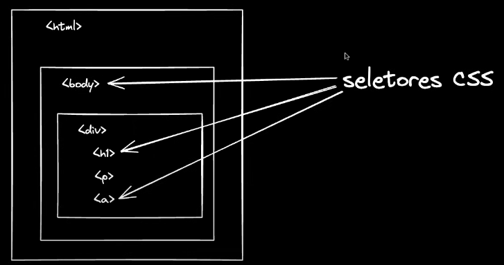

O HTML é estrutura, enquanto o CSS é estilização para dentro da sua aplicação. 

**CSS**: Folha de Estilo em Cascada

Iremos utilizar as tags para aplicar estilos em suas tags. Como utilizaremos os seletores para realizar a estilização. 

### Modelo Caixa 
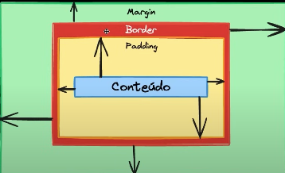

### Tipos de Display
#### 1. Display Inline
Os elementos não consideram a altura e a largura, mantendo os elementos lado a lado.

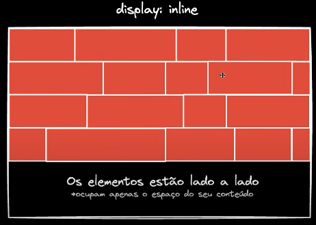

#### 2. Display Block
Somente o trecho é utilizado. Altura e Larguras são consideradas. 

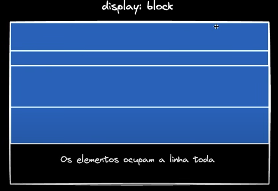

#### 3. Display inline-block
Usa apenas o tamanho necessário a ser ocupado. 

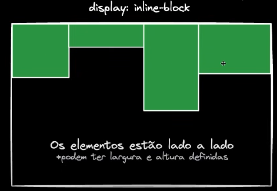

#### 4. Flexbox 
A partir do momento que você define a sua **div** com **display: flex** a caixa que está inserida nessa div será um **flex container**. 

O **Flexbox** (Flexible Box Layout) é um modelo de layout no CSS que permite a distribuição eficiente do espaço entre os itens de um contêiner, mesmo quando suas dimensões são desconhecidas ou dinâmicas. É especialmente útil para criar layouts responsivos e adaptáveis.

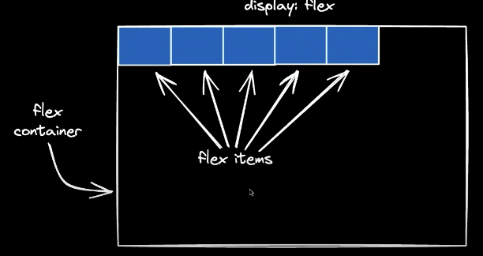

#### Eixos no Flexbox
No Flexbox, há dois eixos principais:

**Main Axis (Eixo Principal)**: É o eixo ao longo do qual os itens flexíveis são dispostos. Por padrão, o eixo principal é horizontal (da esquerda para a direita), mas pode ser alterado para vertical se o flex-direction for definido como column.

**Cross Axis (Eixo Transversal)**: É o eixo que é perpendicular ao eixo principal. Se o eixo principal é horizontal, o eixo transversal será vertical, e vice-versa.

#### Modos do Flexbox 
```js
justify-content: start;
```

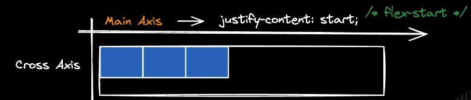

```js
justify-content: end;
```

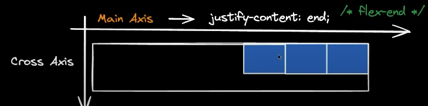

```js
justify-content: center;
```

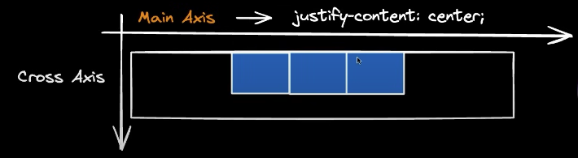

```js
justify-content: space-between;
```

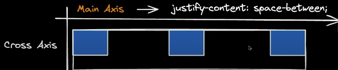

```js
justify-content: space-around;
```

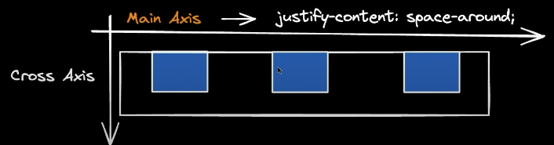

```js
flex-direction: column; 
justify-content: start;
```

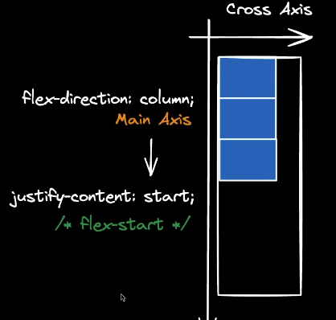

```js
flex-direction: column; 
justify-content: space-around;
```

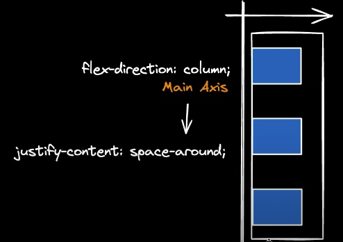

```js
align-items: start; 
```

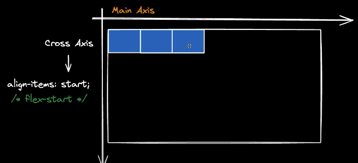

```js
align-items: end; 
```

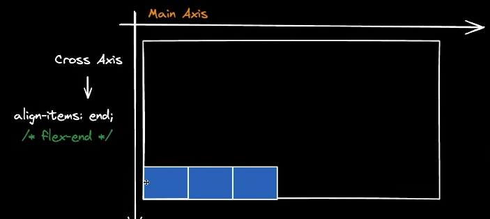

```js
align-items: stretch; 
```

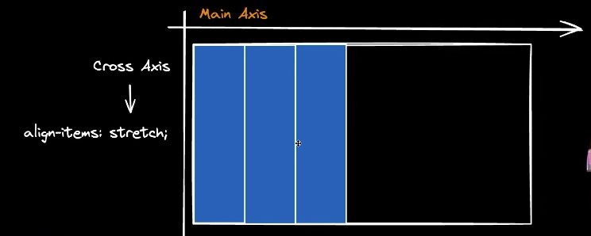

**Exemplo 1**
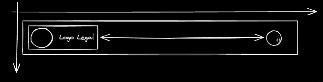

```js
align-items: center; 
justify-content: space-between; 
```

**Exemplo 2**
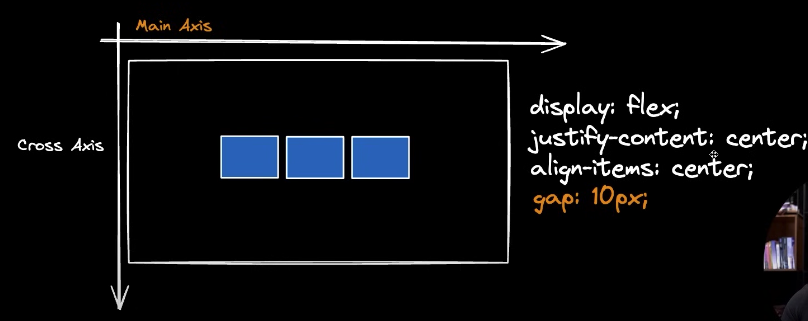

```js
display: flex;
align-items: center; 
justify-content: center; 
gap: 10px; 
```
<!-- gap: espaço entre os elementos >